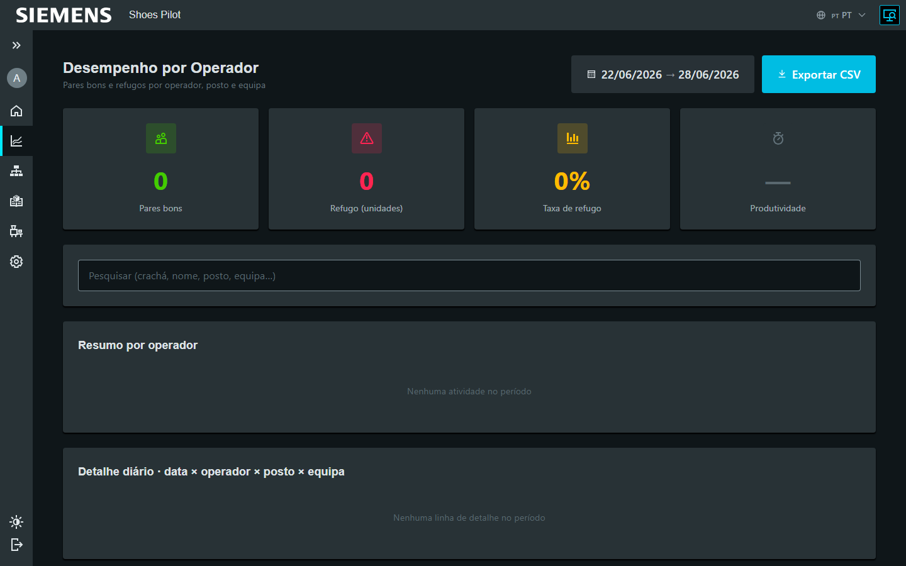

# Exporter les rapports de productivité

Admin

Exportez la performance des opérateurs sur une période, au format CSV.

## 1. Ouvrir le dashboard opérateurs

Menu **Dashboard → Par opérateur**. Choisissez la **période** en haut de page
(par défaut : 7 derniers jours).

<figure class="screenshot" markdown>

<figcaption>Performance par opérateur et sélecteur de période</figcaption>
</figure>

## 2. Exporter

Touchez **Exporter CSV**. Le fichier
`performance_operateurs_<du>_<au>.csv` est téléchargé.

<figure class="screenshot" markdown>

<figcaption>Export CSV de la période sélectionnée</figcaption>
</figure>

!!! info "Contenu du fichier"
    Le CSV contient deux niveaux :

    - **Synthèse par opérateur** : paires bonnes, rebuts, taux de rebut,
      rentabilité.
    - **Détail journalier** : par jour, opérateur, poste, opération et équipe.

!!! tip "Filtrer avant d'exporter"
    Le champ de recherche (badge, nom, poste, équipe) filtre l'affichage à
    l'écran ; l'export reprend la **période** sélectionnée.
