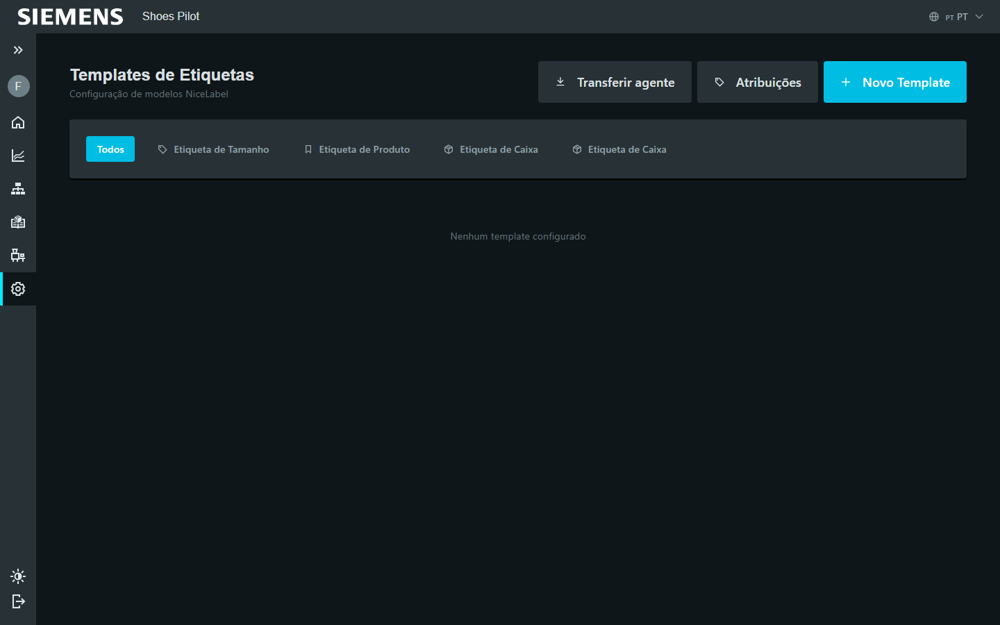

# Ajouter un template d'étiquette

Admin fonctionnel

Importez un modèle d'étiquette, puis indiquez à quelle opération l'imprimer.

## Partie 1 — Importer le template

### 1. Ouvrir les templates

Menu **Administration → Templates d'étiquettes**, puis **Nouveau template**.

<figure class="screenshot" markdown>

<figcaption>Templates d'étiquettes</figcaption>
</figure>

### 2. Décrire et téléverser

1. Choisissez le **type** : Taille, Produit (handtag), Boîte ou Bac.
2. Donnez un **nom**.
3. **Téléversez le fichier** d'étiquette (`.prn` ou `.nlbl`).
4. Laissez **Actif** coché.

<figure class="screenshot" markdown>

<figcaption>Type, nom et fichier d'étiquette</figcaption>
</figure>

!!! info "Fichier accepté"
    Formats `.prn` et `.nlbl`, jusqu'à 10 Mo. Le fichier est stocké sur le
    serveur et réutilisable pour plusieurs opérations.

### 3. Enregistrer

Touchez **Enregistrer** : le template rejoint la bibliothèque.

<figure class="screenshot" markdown>

<figcaption>Template ajouté</figcaption>
</figure>

## Partie 2 — Configurer l'opération qui imprime

### 4. Ouvrir l'opération

Menu **Administration → Opérations**, modifiez l'opération concernée, puis
ouvrez l'onglet **Étiquettes**.

<figure class="screenshot" markdown>

<figcaption>Onglet Étiquettes de l'opération</figcaption>
</figure>

### 5. Associer et régler

Touchez **+ Ajouter**, choisissez le template, puis réglez :

- **Imprimer au démarrage** de l'opération ;
- **Imprimer à la fin** ;
- **Nombre de copies** (1 à 10).

<figure class="screenshot" markdown>

<figcaption>Quand imprimer, et en combien d'exemplaires</figcaption>
</figure>

!!! tip "Plusieurs étiquettes par opération"
    Une opération peut imprimer plusieurs templates (ex. une étiquette taille au
    démarrage et une étiquette boîte à la fin).
