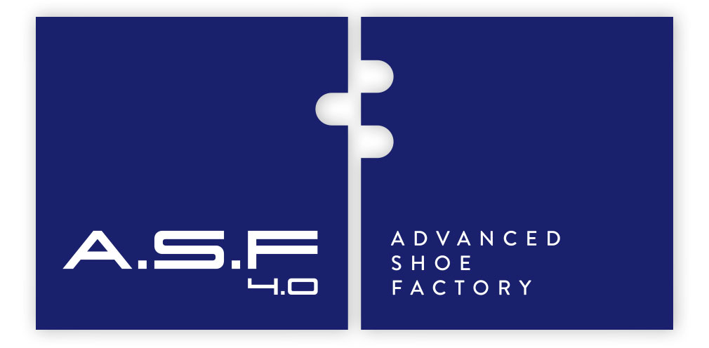

{ .asf }
Funciona sobre&nbsp;
{ width="68" }{ width="68" }
&nbsp;Industrial Edge

# Bem-vindo

Este guia acompanha-o, **ecrã a ecrã**, na utilização diária do Shoes Pilot.
Cada secção corresponde a uma função: vá diretamente à sua.

## :material-login: Primeiros passos

-   :material-login: **Iniciar sessão**

    ---

    Por crachá (operador) ou por identificador (responsável).

    [:octicons-arrow-right-24: Iniciar sessão](prise-en-main/se-connecter.md)

-   :material-account-key: **Funções e acessos**

    ---

    Quem pode fazer o quê na aplicação.

    [:octicons-arrow-right-24: Funções e acessos](prise-en-main/roles-et-acces.md)

## :material-account-hard-hat: Operador

-   :material-play-circle: **Iniciar uma operação**

    ---

    Crachá, leitura do caixote, início.

    [:octicons-arrow-right-24: Iniciar](operateur/demarrer-operation.md)

-   :material-check-circle: **Terminar uma operação**

    ---

    Crachá, seleção da operação, validação.

    [:octicons-arrow-right-24: Terminar](operateur/terminer-operation.md)

## :material-monitor-dashboard: Supervisor

-   :material-rocket-launch: **Lançar a produção de um OF**

    ---

    Iniciar o OF, imprimir as etiquetas de caixote.

    [:octicons-arrow-right-24: Lançar](superviseur/lancer-production.md)

-   :material-alert-octagon: **Declarar uma rejeição**

    ---

    Esquerdo, direito ou par — e a recuperação do sapato órfão.

    [:octicons-arrow-right-24: Rejeição](superviseur/declaration-rebut.md)

-   :material-chart-line: **Supervisionar a produção**

    ---

    Painéis de controlo por operação, equipa, modelo, linha e operador.

    [:octicons-arrow-right-24: Supervisão](superviseur/supervision.md)

## :material-cog: Administração

-   :material-tag-text: **Adicionar um template de etiqueta**

    ---

    Modelo de etiqueta e impressão por operação.

    [:octicons-arrow-right-24: Etiquetas](administration/template-etiquette.md)

-   :material-file-export: **Exportar os relatórios de produtividade**

    ---

    Dados por operador, exportação CSV.

    [:octicons-arrow-right-24: Exportação](administration/export-productivite.md)

-   :material-account-wrench: **Adicionar um posto de trabalho**

    ---

    Criar e configurar um posto de trabalho.

    [:octicons-arrow-right-24: Posto](administration/ajouter-poste.md)

