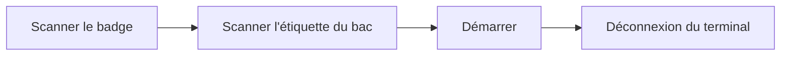

# Démarrer une opération

Opérateur

Vous démarrez une opération sur le **poste** du terminal, pour le **sous-OF** du
bac que vous scannez. L'opération ne peut démarrer que si le bac est **déjà passé
par les postes précédents** du flux.

## 1. Scanner votre badge

Sur le terminal du poste, **scannez votre badge** (ou saisissez le numéro).

<figure class="screenshot terminal" markdown>

<figcaption>Identification de l'opérateur</figcaption>
</figure>

## 2. Scanner l'étiquette du bac

**Scannez le QR code** de l'étiquette du bac. Le terminal identifie le sous-OF et
l'opération à réaliser, et contrôle que le bac est bien à votre poste.

<figure class="screenshot terminal" markdown>

<figcaption>Lecture de l'étiquette du bac</figcaption>
</figure>

!!! warning "Bac non autorisé sur ce poste"
    Le démarrage est **bloqué** si le bac n'a pas encore été traité aux opérations
    précédentes : il doit d'abord passer par les postes amont du flux.

## 3. Démarrer l'opération

Vérifiez le bac affiché (modèle, taille, quantité, opération), puis touchez
**Démarrer l'opération**. Le terminal vous **déconnecte** : l'opération est en
cours et le poste est prêt pour le prochain opérateur.

<figure class="screenshot terminal" markdown>

<figcaption>Vérification du bac, puis Démarrer</figcaption>
</figure>

!!! tip "Étiquettes"
    Certaines opérations impriment automatiquement des étiquettes au démarrage.
