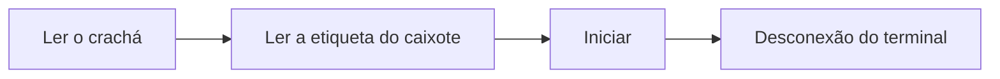

# Iniciar uma operação

Operador

Inicia uma operação no **posto** do terminal, para o **sub-OF** do caixote que
ler. A operação só pode iniciar se o caixote **já tiver passado pelos postos
anteriores** do fluxo.

## 1. Ler o seu crachá

No terminal do posto, **leia o seu crachá** (ou introduza o número).

<figure class="screenshot terminal" markdown>

<figcaption>Identificação do operador</figcaption>
</figure>

## 2. Ler a etiqueta do caixote

**Leia o código QR** da etiqueta do caixote. O terminal identifica o sub-OF e a
operação a realizar, e verifica que o caixote está no seu posto.

<figure class="screenshot terminal" markdown>

<figcaption>Leitura da etiqueta do caixote</figcaption>
</figure>

!!! warning "Caixote não autorizado neste posto"
    O início é **bloqueado** se o caixote ainda não tiver sido tratado nas
    operações anteriores: tem de passar primeiro pelos postos a montante do fluxo.

## 3. Iniciar a operação

Confirme o caixote apresentado (modelo, tamanho, quantidade, operação) e toque em
**Iniciar a operação**. O terminal **desconecta-o**: a operação está em curso e o
posto fica pronto para o próximo operador.

<figure class="screenshot terminal" markdown>

<figcaption>Verificação do caixote e, depois, Iniciar</figcaption>
</figure>

!!! tip "Etiquetas"
    Algumas operações imprimem automaticamente etiquetas no início.
