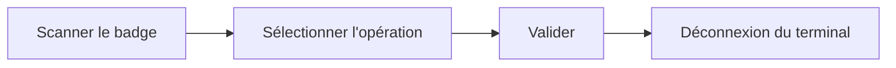

# Terminer une opération

Opérateur

Une fois le travail réalisé, vous **validez** l'opération démarrée sur le bac.
La production est comptée et le bac avance dans le flux. À faire après avoir
[démarré l'opération](demarrer-operation.md).

## 1. Vous ré-authentifier

Revenez au terminal du poste et **scannez votre badge** (ou saisissez le numéro).

<figure class="screenshot terminal" markdown>

<figcaption>Identification de l'opérateur</figcaption>
</figure>

## 2. Sélectionner l'opération

Choisissez l'opération à clôturer dans la **liste de vos opérations en cours**. Le
terminal affiche le bac correspondant (modèle, taille, quantité).

<figure class="screenshot terminal" markdown>

<figcaption>Opérations en cours de l'opérateur</figcaption>
</figure>

!!! tip "Scan du bac"
    Vous pouvez aussi **rescanner l'étiquette du bac** pour retrouver directement
    l'opération, mais ce n'est pas nécessaire.

!!! warning "Pièce défectueuse ?"
    Avant de valider, signalez toute pièce défectueuse — voir
    [Déclarer un rebut](../superviseur/declaration-rebut.md).

## 3. Valider l'opération

Touchez **Valider l'opération**. C'est terminé : la production est comptée, le
bac passe à la suite et le terminal vous **déconnecte**.

<figure class="screenshot terminal" markdown>

<figcaption>Opération validée</figcaption>
</figure>

!!! tip "Étiquettes"
    Certaines opérations impriment automatiquement des étiquettes à la validation.
