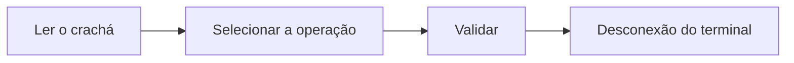

# Terminar uma operação

Operador

Terminado o trabalho, **valida** a operação iniciada no caixote. A produção é
contabilizada e o caixote avança no fluxo. A fazer depois de
[iniciar a operação](demarrer-operation.md).

## 1. Reautenticar-se

Volte ao terminal do posto e **leia o seu crachá** (ou introduza o número).

<figure class="screenshot terminal" markdown>

<figcaption>Identificação do operador</figcaption>
</figure>

## 2. Selecionar a operação

Escolha a operação a encerrar na **lista das suas operações em curso**. O terminal
apresenta o caixote correspondente (modelo, tamanho, quantidade).

<figure class="screenshot terminal" markdown>

<figcaption>Operações em curso do operador</figcaption>
</figure>

!!! tip "Leitura do caixote"
    Também pode **reler a etiqueta do caixote** para recuperar diretamente a
    operação, mas não é necessário.

!!! warning "Peça defeituosa?"
    Antes de validar, assinale qualquer peça defeituosa — consulte
    [Declarar uma sucata](../superviseur/declaration-rebut.md).

## 3. Validar a operação

Toque em **Validar a operação**. Está concluído: a produção é contabilizada, o
caixote avança para a etapa seguinte e o terminal **desconecta-o**.

<figure class="screenshot terminal" markdown>

<figcaption>Operação validada</figcaption>
</figure>

!!! tip "Etiquetas"
    Algumas operações imprimem automaticamente etiquetas na validação.
