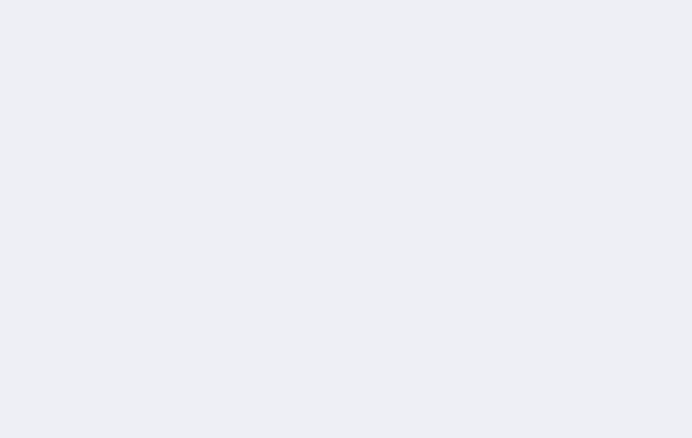
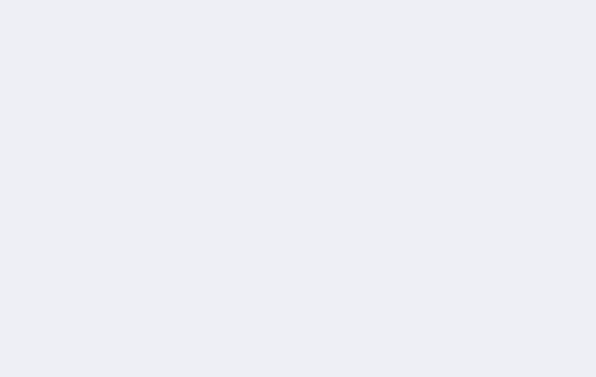

# Ajouter un opérateur

Superviseur

Créez un opérateur pour qu'il puisse se connecter au terminal par badge.

## 1. Ouvrir la liste

Menu **Administration → Opérateurs**, puis touchez **Nouvel opérateur**.

<figure class="screenshot" markdown>

<figcaption>Liste des opérateurs</figcaption>
</figure>

## 2. Renseigner l'opérateur

Saisissez les trois champs requis :

| Champ | Exemple |
|-------|---------|
| **Badge** | `12345678` |
| **Prénom** | Jean |
| **Nom** | Dupont |

<figure class="screenshot" markdown>

<figcaption>Création d'un opérateur</figcaption>
</figure>

!!! info "Le badge = la connexion"
    Le numéro de badge est l'identifiant scanné sur le terminal. Il doit être
    **unique**.

## 3. Enregistrer

Touchez **Enregistrer** : l'opérateur apparaît dans la liste et peut se
connecter.

<figure class="screenshot" markdown>

<figcaption>Opérateur ajouté à la liste</figcaption>
</figure>

!!! tip "Désactiver un opérateur"
    Un opérateur n'est jamais supprimé : il est **désactivé** (filtre Actifs /
    Inactifs). Réactivez-le au besoin avec un nouveau badge.
