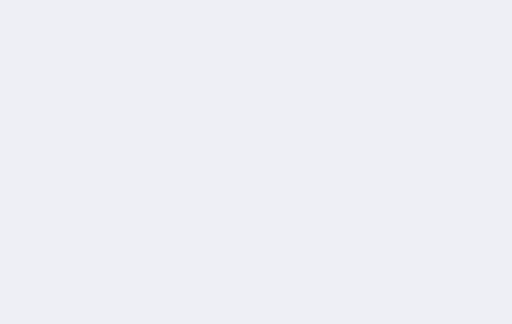
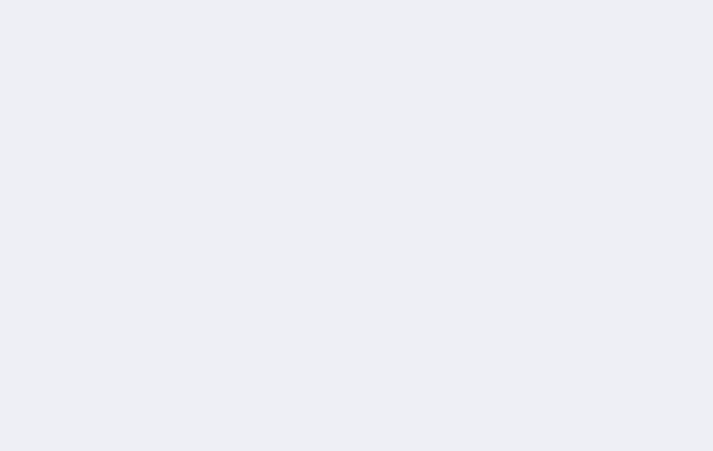

# Configurer un ordre de fabrication

Admin Admin fonctionnel

Un **ordre de fabrication (OF)** représente une commande de production pour un
modèle/coloris, avec des quantités par taille. Il se subdivise en **sous-OF**
(lots) pour un suivi granulaire sur le terminal.

!!! info "OF importés depuis l'ERP"
    En production, les OF sont **importés depuis l'ERP** (fichiers XML PRIOS,
    dossier surveillé) et rattachés à leur article du catalogue. La création
    manuelle se fait depuis la page **Articles** ou **Ordres de fabrication**.

## 1. Liste des ordres de fabrication

La page **Ordres de fabrication** liste les OF avec leur statut, priorité et
échéance.

<figure class="screenshot" markdown>

<figcaption>Liste des ordres de fabrication</figcaption>
</figure>

## 2. Détail d'un OF

La page de détail affiche les **informations produit** (avec photo), la
**répartition par taille** et la liste des **sous-OF** avec leur statut.

<figure class="screenshot" markdown>

<figcaption>Détail d'un OF : produit, tailles et sous-OF</figcaption>
</figure>

## 3. Générer les sous-OF

Si une **configuration de subdivision** est définie, ouvrez le détail de l'OF et
cliquez sur **Générer les sous-OF** : le système crée automatiquement les lots
selon les règles (paires par sous-OF, points de rupture, etc.).

<figure class="screenshot" markdown>

<figcaption>Sous-OF générés à partir de l'OF</figcaption>
</figure>

## Écrans de configuration métier

L'administration permet de définir le flux de production et les référentiels.

=== "Opérations"

    Définissez les étapes du flux (code, séquence, durée estimée, contrôle
    qualité requis).

    <figure class="screenshot" markdown>
    
    <figcaption>Configuration des opérations</figcaption>
    </figure>

=== "Lignes de production"

    Regroupez les opérations par zone physique, définissez l'ordre et la ligne
    par défaut.

    <figure class="screenshot" markdown>
    
    <figcaption>Configuration des lignes de production</figcaption>
    </figure>

## Autres référentiels

La configuration métier couvre aussi : **postes de travail**, **équipes**,
**opérateurs**, **modèles**, **configurations de subdivision**, **motifs de
rebut**, **imprimantes** et **templates d'étiquettes**. Chacun suit la même
logique : liste, création, édition, désactivation (suppression douce).
