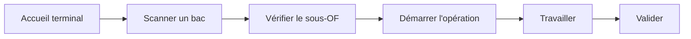

# Pointer une opération

Opérateur

Le pointage est le geste quotidien de l'opérateur : il déclare le **début** et
la **fin** d'une opération sur un sous-OF (un bac de paires). Le système
enregistre la production, met à jour les tableaux de bord en temps réel et fait
avancer le sous-OF dans le flux de fabrication.

## Vue d'ensemble du parcours

## 1. Accueil du terminal

Après connexion par badge, l'accueil affiche votre **production du jour**, la
**file d'attente** de votre poste et l'accès au **scan d'un bac**.

<figure class="screenshot terminal" markdown>

<figcaption>Accueil : production du jour et file d'attente du poste</figcaption>
</figure>

## 2. Scanner un bac

1. Cliquez sur **Scanner un bac**.
2. Scannez le **QR code** du bac ou saisissez son numéro.

<figure class="screenshot terminal" markdown>

<figcaption>Scan du QR code du bac ou saisie manuelle du numéro</figcaption>
</figure>

## 3. Vérifier le sous-OF

L'écran affiche les informations du bac : **photo** du modèle/coloris,
**taille**, **quantité** et **numéro d'opération**. Vérifiez que le sous-OF
correspond bien à votre poste.

<figure class="screenshot terminal" markdown>

<figcaption>Informations du bac avant démarrage</figcaption>
</figure>

!!! warning "Mauvaise opération ?"
    Si le sous-OF n'est pas à votre opération, le système vous avertit : le bac
    doit d'abord passer par les opérations précédentes.

## 4. Démarrer et travailler

Cliquez sur **Démarrer l'opération**. L'écran passe en mode « opération en
cours » : vous réalisez le travail sur les paires, et pouvez à tout moment
[déclarer un rebut](declaration-rebut.md).

<figure class="screenshot terminal" markdown>

<figcaption>Opération en cours : compteurs, rebuts et réintégrations</figcaption>
</figure>

## 5. Valider

Cliquez sur **Valider l'opération**. Le système :

- enregistre la production réalisée ;
- passe au sous-OF suivant en cas de subdivision ;
- met à jour les tableaux de bord en temps réel ;
- gère automatiquement le stock de réintégration.

<figure class="screenshot terminal" markdown>

<figcaption>Confirmation de validation de l'opération</figcaption>
</figure>

!!! tip "Étiquettes"
    Selon la configuration de l'opération, des étiquettes peuvent s'imprimer
    automatiquement au démarrage et/ou à la fin du pointage.
