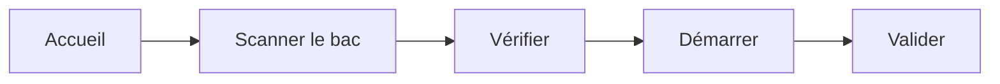

# Pointer une opération

Opérateur

Déclarez le **début** et la **fin** de votre opération sur un bac. La production
est enregistrée et le bac avance dans le flux.

## 1. Scanner le bac

Sur l'accueil, touchez **Scanner un bac**, puis scannez le QR code (ou saisissez
le numéro).

<figure class="screenshot terminal" markdown>

<figcaption>Accueil : production du jour et file d'attente</figcaption>
</figure>

## 2. Vérifier

Contrôlez le bac affiché : modèle, taille, quantité, opération.

<figure class="screenshot terminal" markdown>

<figcaption>Informations du bac avant démarrage</figcaption>
</figure>

!!! warning "Mauvaise opération ?"
    Le système vous bloque si le bac n'est pas à votre poste : il doit passer
    par les opérations précédentes d'abord.

## 3. Démarrer

Touchez **Démarrer l'opération** et réalisez le travail. Pour signaler une pièce
défectueuse, voir [Déclarer un rebut](declaration-rebut.md).

<figure class="screenshot terminal" markdown>

<figcaption>Opération en cours</figcaption>
</figure>

## 4. Valider

Touchez **Valider l'opération**. C'est terminé : la production est comptée et le
bac passe à la suite.

<figure class="screenshot terminal" markdown>

<figcaption>Opération validée</figcaption>
</figure>

!!! tip "Étiquettes"
    Certaines opérations impriment automatiquement des étiquettes au démarrage
    et/ou à la validation.
