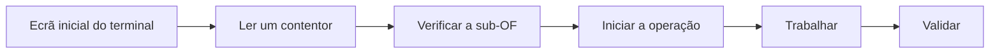

# Registar uma operação

Operador

O registo é o gesto diário do operador: declara o **início** e o **fim** de uma
operação numa sub-OF (um contentor de pares). O sistema regista a produção,
atualiza os painéis de controlo em tempo real e faz avançar a sub-OF no fluxo de
fabrico.

## Visão geral do percurso

## 1. Ecrã inicial do terminal

Após o início de sessão por crachá, o ecrã inicial apresenta a sua **produção do
dia**, a **fila de espera** do seu posto e o acesso à **leitura de um
contentor**.

<figure class="screenshot terminal" markdown>

<figcaption>Ecrã inicial: produção do dia e fila de espera do posto</figcaption>
</figure>

## 2. Ler um contentor

1. Clique em **Ler um contentor**.
2. Leia o **código QR** do contentor ou introduza o respetivo número.

<figure class="screenshot terminal" markdown>

<figcaption>Leitura do código QR do contentor ou introdução manual do número</figcaption>
</figure>

## 3. Verificar a sub-OF

O ecrã apresenta as informações do contentor: **fotografia** do modelo/cor,
**tamanho**, **quantidade** e **número de operação**. Verifique se a sub-OF
corresponde efetivamente ao seu posto.

<figure class="screenshot terminal" markdown>

<figcaption>Informações do contentor antes do arranque</figcaption>
</figure>

!!! warning "Operação errada?"
    Se a sub-OF não estiver na sua operação, o sistema avisa-o: o contentor
    deve primeiro passar pelas operações anteriores.

## 4. Iniciar e trabalhar

Clique em **Iniciar a operação**. O ecrã passa para o modo «operação em
curso»: realiza o trabalho nos pares e pode, a qualquer momento,
[declarar uma rejeição](declaration-rebut.md).

<figure class="screenshot terminal" markdown>

<figcaption>Operação em curso: contadores, rejeições e reintegrações</figcaption>
</figure>

## 5. Validar

Clique em **Validar a operação**. O sistema:

- regista a produção realizada;
- avança para a sub-OF seguinte em caso de subdivisão;
- atualiza os painéis de controlo em tempo real;
- gere automaticamente o stock de reintegração.

<figure class="screenshot terminal" markdown>

<figcaption>Confirmação da validação da operação</figcaption>
</figure>

!!! tip "Etiquetas"
    Consoante a configuração da operação, podem ser impressas etiquetas
    automaticamente no arranque e/ou no fim do registo.
