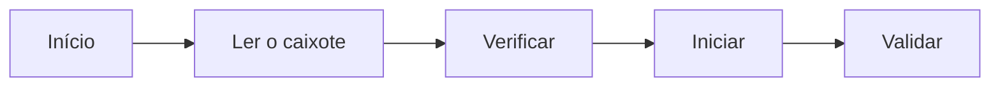

# Apontar uma operação

Operador

Declare o **início** e o **fim** da sua operação num caixote. A produção é
registada e o caixote avança no fluxo.

## 1. Ler o caixote

No ecrã inicial, toque em **Ler um caixote** e leia o código QR (ou introduza o
número).

<figure class="screenshot terminal" markdown>

<figcaption>Ecrã inicial: produção do dia e fila de espera</figcaption>
</figure>

## 2. Verificar

Confirme o caixote apresentado: modelo, tamanho, quantidade, operação.

<figure class="screenshot terminal" markdown>

<figcaption>Informações do caixote antes de iniciar</figcaption>
</figure>

!!! warning "Operação errada?"
    O sistema bloqueia-o se o caixote não estiver no seu posto: tem de passar
    primeiro pelas operações anteriores.

## 3. Iniciar

Toque em **Iniciar a operação** e execute o trabalho. Para assinalar uma peça
defeituosa, consulte [Declarar uma sucata](declaration-rebut.md).

<figure class="screenshot terminal" markdown>

<figcaption>Operação em curso</figcaption>
</figure>

## 4. Validar

Toque em **Validar a operação**. Está concluído: a produção é contabilizada e o
caixote avança para a etapa seguinte.

<figure class="screenshot terminal" markdown>

<figcaption>Operação validada</figcaption>
</figure>

!!! tip "Etiquetas"
    Algumas operações imprimem automaticamente etiquetas no início e/ou na
    validação.
