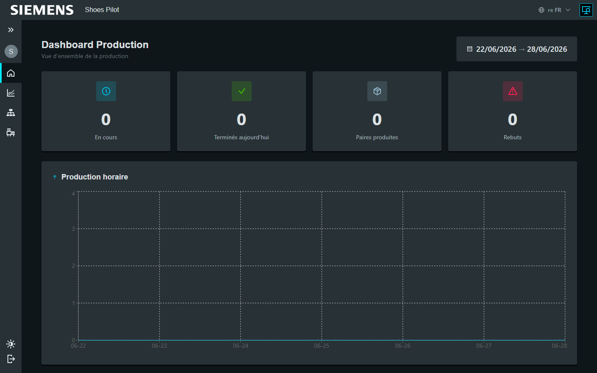
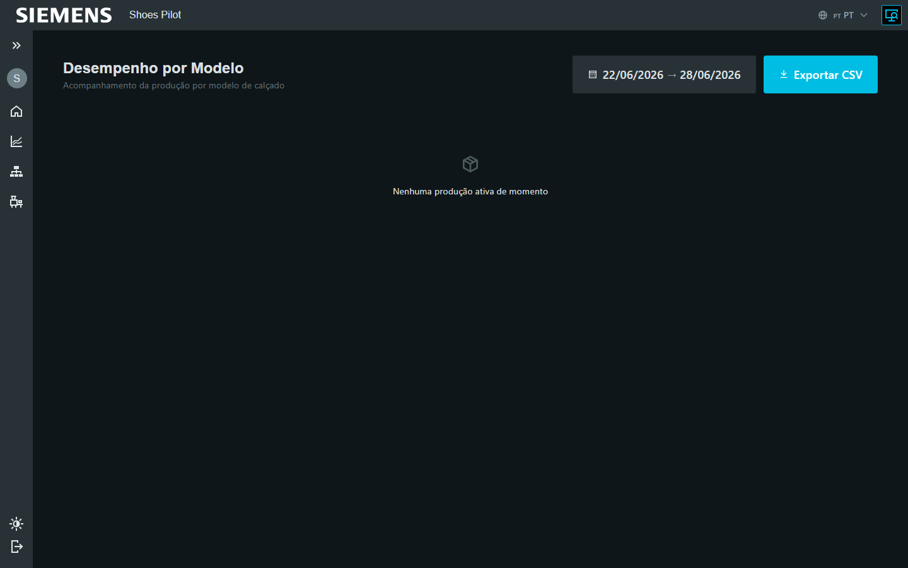
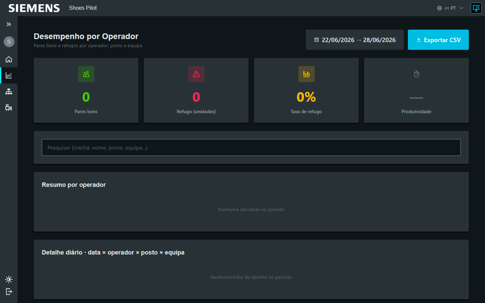

# Superviser la production

Superviseur Admin

Suivez la production en temps réel. Les tableaux de bord se rafraîchissent tout
seuls (15–30 s) et s'analysent selon plusieurs axes.

## Vue globale

En cours, terminés du jour, paires produites, rebuts, et la production heure par
heure.

<figure class="screenshot" markdown>

<figcaption>Vue d'ensemble du jour</figcaption>
</figure>

## Par opération

Sous-OF en attente et en cours sur chaque étape.

<figure class="screenshot" markdown>

<figcaption>Production par opération</figcaption>
</figure>

## Par équipe

Performance des équipes et classement des opérateurs.

<figure class="screenshot" markdown>

<figcaption>Performance par équipe</figcaption>
</figure>

## Par modèle

État de la production pour chaque modèle.

<figure class="screenshot" markdown>

<figcaption>Production par modèle</figcaption>
</figure>

## Par ligne

Performance par ligne, avec filtres temporels (**équipe en cours**, **équipe
précédente**, **dernières 24 h**). Indicateurs : sous-OF actifs, en cours,
terminés, paires, **efficacité** et **taux de rebuts**.

<figure class="screenshot" markdown>

<figcaption>Performance par ligne</figcaption>
</figure>

## Par opérateur

Classement et indicateurs individuels : paires, efficacité, taux de rebuts,
comparaison à la moyenne de l'équipe.

<figure class="screenshot" markdown>

<figcaption>Performance par opérateur</figcaption>
</figure>
