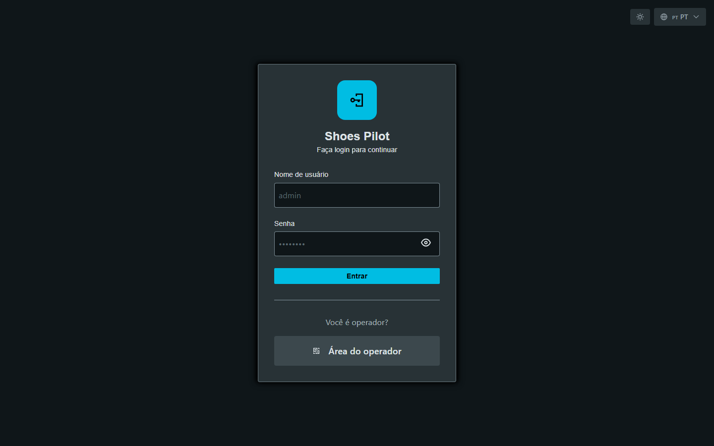

# Se connecter

## Opérateur — par badge

Sur le terminal tactile :

1. Touchez **Connexion par badge**.
2. Sélectionnez votre **poste de travail**.
3. **Scannez votre badge** (ou saisissez le numéro).

<figure class="screenshot terminal" markdown>

<figcaption>Choix du poste de travail</figcaption>
</figure>

<figure class="screenshot terminal" markdown>

<figcaption>Scan ou saisie du badge</figcaption>
</figure>

Vous arrivez sur l'**accueil du terminal**.

<figure class="screenshot terminal" markdown>

<figcaption>Accueil du terminal de pointage</figcaption>
</figure>

## Encadrant — par identifiant

Saisissez votre **identifiant** et **mot de passe**, puis **Se connecter**.

<figure class="screenshot" markdown>

<figcaption>Connexion Admin / Superviseur</figcaption>
</figure>

Vous arrivez sur le **tableau de bord** de votre rôle.

!!! tip "Changer de langue"
    Le sélecteur 🌐 (en haut à droite) bascule entre français, anglais et
    portugais.
