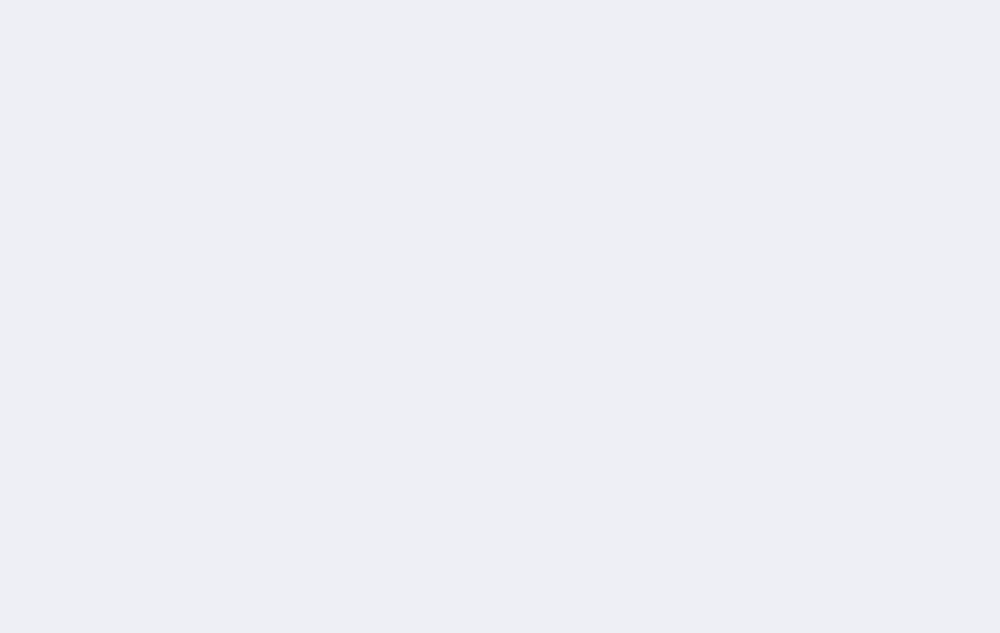

# Iniciar sessão

Dois modos de início de sessão consoante o perfil: **identificador/palavra-passe**
para os responsáveis, **crachá** para os operadores no terminal.

## Início de sessão por identificador (Administrador, Supervisor)

1. Abra a aplicação no seu navegador.
2. Introduza o seu **identificador** e a sua **palavra-passe**.
3. Clique em **Iniciar sessão**.

<figure class="screenshot" markdown>

<figcaption>Ecrã de início de sessão por identificador e palavra-passe</figcaption>
</figure>

Acede ao **painel de controlo** correspondente à sua função.

<figure class="screenshot" markdown>

<figcaption>Painel de controlo global apresentado após o início de sessão</figcaption>
</figure>

## Início de sessão por crachá (Operador)

No terminal tátil:

1. Clique em **Início de sessão por crachá**.
2. Selecione o seu **posto de trabalho** (consoante a configuração do quiosque).
3. **Leia o seu crachá** ou introduza o número manualmente.

<figure class="screenshot terminal" markdown>

<figcaption>Seleção do posto de trabalho antes da leitura do crachá</figcaption>
</figure>

<figure class="screenshot terminal" markdown>

<figcaption>Leitura ou introdução do número de crachá</figcaption>
</figure>

Uma vez identificado, acede ao **ecrã inicial do terminal de registo**.

<figure class="screenshot terminal" markdown>

<figcaption>Ecrã inicial do terminal após início de sessão por crachá</figcaption>
</figure>

!!! tip "Mudar de idioma"
    O seletor de idioma (🌐 no canto superior direito) permite alternar entre
    **francês**, **inglês** e **português** a qualquer momento.
