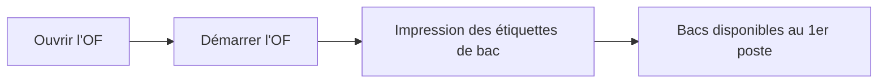

# Lancer la production d'un OF

Superviseur Admin

Lancer un OF déclenche l'**impression des étiquettes de bac** et met les bacs à
disposition du **premier poste** de la ligne. À faire une fois les sous-OF de l'OF
générés.

## 1. Ouvrir l'OF

Dans l'administration, ouvrez les **Ordres de fabrication** et sélectionnez l'OF à
lancer.

<figure class="screenshot" markdown>

<figcaption>Ordres de fabrication</figcaption>
</figure>

## 2. Démarrer l'OF

Sur le détail de l'OF, touchez **Démarrer l'OF**. Les sous-OF passent en
production et les **étiquettes de bac sont imprimées** automatiquement.

<figure class="screenshot" markdown>

<figcaption>Détail de l'OF : action Démarrer</figcaption>
</figure>

!!! warning "Sous-OF requis"
    Si aucun sous-OF n'existe encore, générez-les d'abord depuis le détail de
    l'OF (action **Générer les sous-OF**).

## 3. Mise à disposition au premier poste

Munissez chaque bac de son étiquette imprimée. Les bacs sont alors **disponibles
au premier poste de travail** : l'opérateur peut
[démarrer la première opération](../operateur/demarrer-operation.md).

<figure class="screenshot" markdown>

<figcaption>Bacs (sous-OF) prêts pour la production</figcaption>
</figure>
