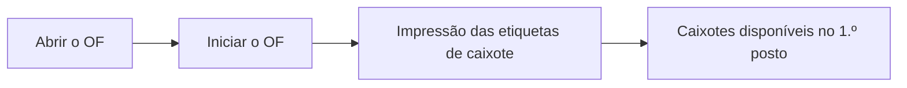
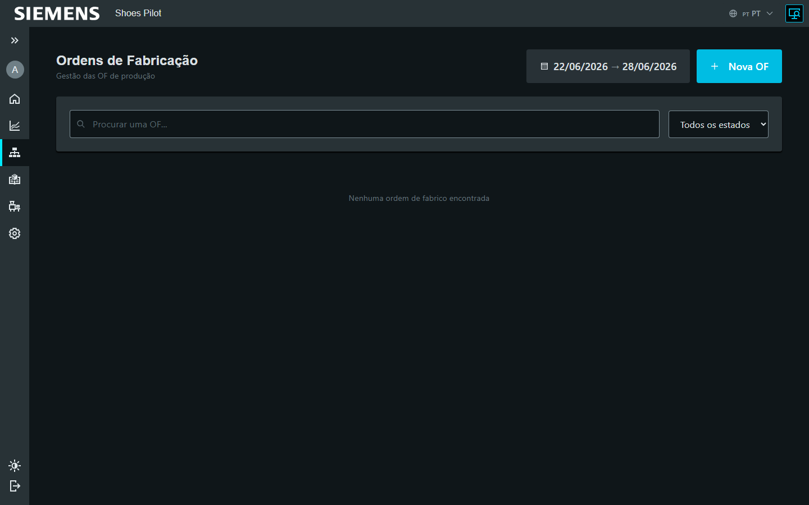

# Lançar a produção de um OF

Supervisor Admin

Lançar um OF desencadeia a **impressão das etiquetas de caixote** e disponibiliza
os caixotes ao **primeiro posto** da linha. A fazer depois de gerar os sub-OF do
OF.

## 1. Abrir o OF

Na administração, abra as **Ordens de fabrico** e selecione o OF a lançar.

<figure class="screenshot" markdown>

<figcaption>Ordens de fabrico</figcaption>
</figure>

## 2. Iniciar o OF

No detalhe do OF, toque em **Iniciar o OF**. Os sub-OF passam a produção e as
**etiquetas de caixote são impressas** automaticamente.

<figure class="screenshot" markdown>

<figcaption>Detalhe do OF: ação Iniciar</figcaption>
</figure>

!!! warning "Sub-OF necessários"
    Se ainda não existir nenhum sub-OF, gere-os primeiro a partir do detalhe do
    OF (ação **Gerar os sub-OF**).

## 3. Disponibilização no primeiro posto

Coloque em cada caixote a respetiva etiqueta impressa. Os caixotes ficam então
**disponíveis no primeiro posto de trabalho**: o operador pode
[iniciar a primeira operação](../operateur/demarrer-operation.md).

<figure class="screenshot" markdown>

<figcaption>Caixotes (sub-OF) prontos para a produção</figcaption>
</figure>
